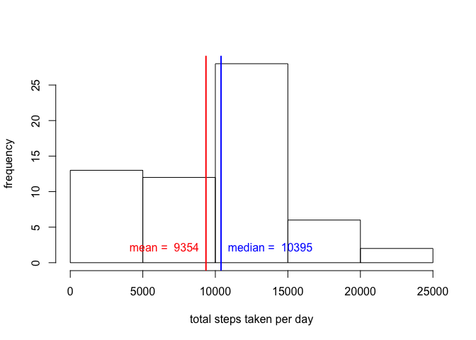

# Reproducible Research: Peer Assessment 1
  
## Loading and preprocessing the data


```r
# Download and read in the data

if (!file.exists("activity.csv")) {
  download.file(
    "https://d396qusza40orc.cloudfront.net/repdata%2Fdata%2Factivity.zip",
    "activity.zip"
  )
  unzip("activity.zip")
}
df <- read.csv("activity.csv", stringsAsFactors = FALSE)
```
### Create new variables


```r
df$date <- as.Date(df$date)
df$day <- weekdays(df[,"date"], abbreviate = TRUE)
head(df)
```

```
##   steps       date interval day
## 1    NA 2012-10-01        0 Mon
## 2    NA 2012-10-01        5 Mon
## 3    NA 2012-10-01       10 Mon
## 4    NA 2012-10-01       15 Mon
## 5    NA 2012-10-01       20 Mon
## 6    NA 2012-10-01       25 Mon
```

### Compute average steps by date (i.e. for each day)


```r
sum.by.date <- tapply(df$steps, df$date, sum, na.rm = TRUE)
mean.sum.by.date <- round(mean(sum.by.date))
med.sum.by.date <- round(median(sum.by.date))
head(sum.by.date)
```

```
## 2012-10-01 2012-10-02 2012-10-03 2012-10-04 2012-10-05 2012-10-06 
##          0        126      11352      12116      13294      15420
```
### Compute average steps by 5-minute interval and by days of week and across all days

```r
mean.by.intl <- tapply(df$steps, list(df$interval, df$day), mean, na.rm = TRUE)
mean.by.intl <- data.frame(interval = as.numeric(rownames(mean.by.intl)), mean.by.intl)
mean.by.intl$All <- tapply(df$steps, df$interval, mean, na.rm = TRUE)
max.index <- which(mean.by.intl$All == max(mean.by.intl$All))
max.intl <- mean.by.intl[max.index, "interval"]
head(mean.by.intl)
```

```
##    interval Fri      Mon Sat      Sun   Thu       Tue   Wed       All
## 0         0   0 1.428571   0 0.000000 5.875 0.0000000 4.250 1.7169811
## 5         5   0 0.000000   0 0.000000 0.000 0.0000000 2.250 0.3396226
## 10       10   0 0.000000   0 0.000000 0.000 0.0000000 0.875 0.1320755
## 15       15   0 0.000000   0 0.000000 1.000 0.0000000 0.000 0.1509434
## 20       20   0 0.000000   0 0.000000 0.000 0.4444444 0.000 0.0754717
## 25       25   0 5.000000   0 7.428571 1.375 1.4444444 0.000 2.0943396
```

## Mean total number of steps taken per day?

```r
hist(sum.by.date, xlab = "total steps taken per day", ylab = "frequency", main = NULL)
abline(v = mean.sum.by.date, col = "red", lwd = 2)
abline(v = med.sum.by.date, col = "blue", lwd = 2)
text(mean.sum.by.date, 2, paste("mean = ", mean.sum.by.date), col = "red", pos = 2)
text(med.sum.by.date, 2, paste("median = ", med.sum.by.date), col = "blue", pos = 4)
```

 

The average number of steps taken per day is , 9354, the median is 1.0395\times 10^{4}

```r
barplot(sum.by.date, ylab = "total steps taken per day")
```

 
# Generating an average daily activity pattern

```r
plot(
  mean.by.intl$interval,
  mean.by.intl$All,
  type = "l",
  xlab = "5-minute interval",
  ylab = "average steps taken through all days"
)
abline(v = max.intl, col = "red", lwd = 2)
text(max.intl, 5, paste("5-Minute Interval = ", max.intl), col = "red", pos = 4)
```

 

5-minute interval containing the maximum amount of steps through all days is 835.

## Imputing missing values


```r
NA.rec <- which(is.na(df$steps))
NA.count <- length(NA.rec)
```
There are 2304 missing values in the original data set.

### Create a new dataset from the original with the missing values substituted by the mean for that interval for that day of the week


```r
new.df <- df
for (i in NA.rec){
  new.df$steps[i] = mean.by.intl[mean.by.intl$interval == new.df$interval[i], new.df$day[i]]
}
new.df$type <- ifelse(new.df$day %in% c("Sat", "Sun"), "weekend", "weekday")
head(new.df)
```

```
##      steps       date interval day    type
## 1 1.428571 2012-10-01        0 Mon weekday
## 2 0.000000 2012-10-01        5 Mon weekday
## 3 0.000000 2012-10-01       10 Mon weekday
## 4 0.000000 2012-10-01       15 Mon weekday
## 5 0.000000 2012-10-01       20 Mon weekday
## 6 5.000000 2012-10-01       25 Mon weekday
```

### Compute average steps by date

```r
new.sum.by.date <- tapply(new.df$steps, new.df$date, sum, na.rm = TRUE)
new.mean.sum.by.date <- round(mean(new.sum.by.date))
new.med.sum.by.date <- round(median(new.sum.by.date))
head(new.sum.by.date)
```

```
## 2012-10-01 2012-10-02 2012-10-03 2012-10-04 2012-10-05 2012-10-06 
##   9974.857    126.000  11352.000  12116.000  13294.000  15420.000
```
### Caclulate average steps by 5-minute interval and by weekend/weekday

```r
library(reshape2)
new.mean.by.intl <- tapply(new.df$steps, list(new.df$interval, new.df$type), mean)
new.mean.by.intl <- data.frame(
  interval = as.numeric(rownames(new.mean.by.intl)),
  new.mean.by.intl
)
new.mean.by.intl <- melt(
  new.mean.by.intl,
  id = "interval",
  measure.vars = c("weekend", "weekday")
)
names(new.mean.by.intl) = c("interval", "type", "steps")
new.mean.by.intl$type <- as.factor(new.mean.by.intl$type)
head(new.mean.by.intl)
```

```
##   interval    type    steps
## 1        0 weekend 0.000000
## 2        5 weekend 0.000000
## 3       10 weekend 0.000000
## 4       15 weekend 0.000000
## 5       20 weekend 0.000000
## 6       25 weekend 3.714286
```

```r
hist(
  new.sum.by.date,
  xlab = "total steps taken per day (new)",
  ylab = "frequency",
  main = NULL
)
abline(v = new.mean.sum.by.date, col = "red", lwd = 2)
abline(v = new.med.sum.by.date, col = "blue", lwd = 2)
text(new.mean.sum.by.date, 2, paste("mean = ", new.mean.sum.by.date), col = "red", pos = 2)
text(new.med.sum.by.date, 2, paste("median = ", new.med.sum.by.date), col = "blue", pos = 4)
```

 

After imputing missing values, the new mean and median of steps taken per day are 1.0821\times 10^{4} and 1.1015\times 10^{4} respectively, compared to 9354  and 1.0395\times 10^{4} before imputing

## differences in activity patterns between weekdays and weekends?


```r
library(lattice)
xyplot(
  steps ~ interval | type,
  data = new.mean.by.intl,
  layout = c(1,2),
  type = "l",
  xlab = "5-minute interval",
  ylab = "mean steps taken"
)
```

 
